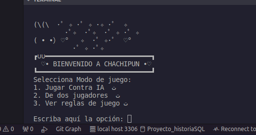
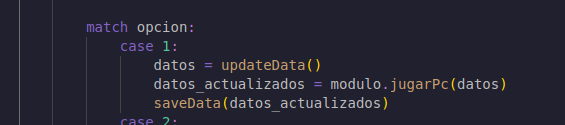

# ProyectoPython_HernandezDayana

Al iniciar el programa me muestra este menú
con las dos opciones de juego y las reglas que deben conocer 
este menu, y el menu de reglas se encuentran en un modulo aparte y solo lo importo en el main asi:

en la opcion 1 tenemos la parte de jugar vs IA o maquina, entonces llamamos al modulo y llamamos a la funcion de actualizar y guardar data Json 

El código busca en un diccionario llamado ptos para encontrar el primer índice donde el valor de 'users' sea igual a user.
La función next() toma ese generador y te da el primer índice que encontró. Si no hay coincidencias, simplemente te devuelve None.
Si no se encuentra el diccionaro, se crea 

entramos al ciclo while donde se elijen las opciones de user y la maquina elije una opcion random y debemos comprobar que las partidas jugadas y ganadas sean meno a 3, ya que si son 3, se termina la partida y se debe tener un ganador 

para cada partida tenemos rondas jugadas y ganadas de user y maquina o jugador 1 y jugador 2 dependiendo su modo de juego, eso lo guardamos todo en un diccionario para facilitar el almacenamiento de datos 

en el diccionario de jugador vs jugador se agregan otras variables como es el nombre completo y nickname de cada jugador, pero tienen en comun los datos guardados de puntos

En cada opcion de juego tenemos que si se ganan dos partidas consecutivas se active un escudo, entonces tenemos las variables 

tenemos el escudo en false y luego en la logica lo convertimos en true 

y si le ganan entonces pierde ese escudo....

Mi manejo es que en cada ronda ganada se le suma 1 al contador que es el que se guarda en el json y asi se comprueba cada cosa

Manejo un modulo init donde cargo todos los modulos y es mucho mas comodo al momento de llamar las funciones en el main, ya que no me toca por separado cada uno 

Tengo un manejo de error donde se supone me debe validar cualquier tipo de error que el usuario intente
